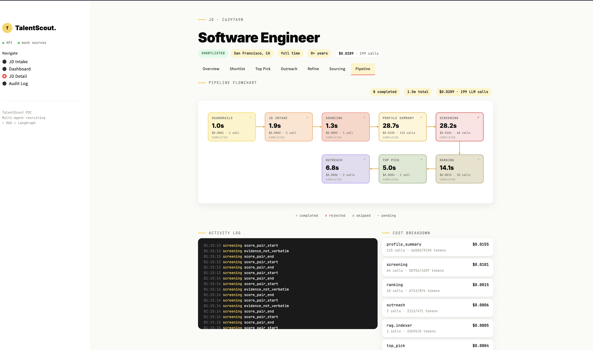
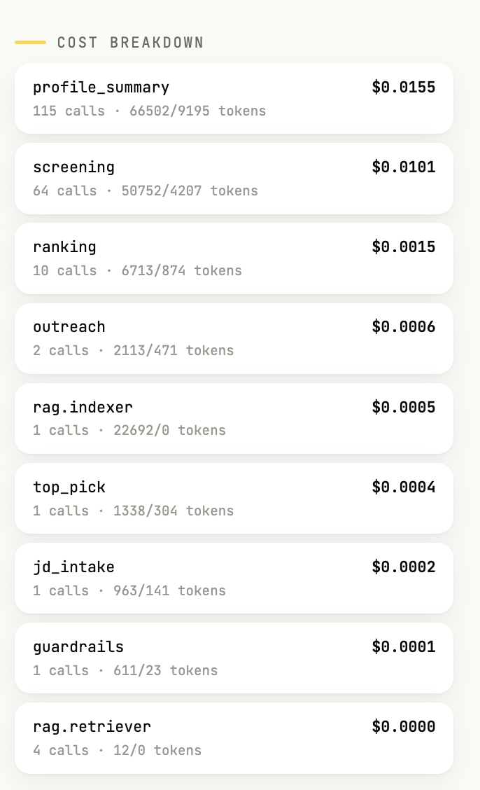
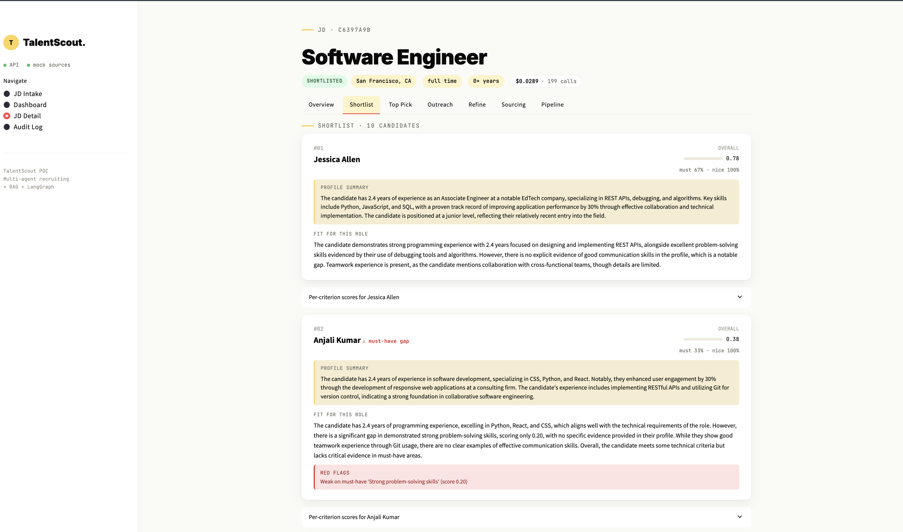
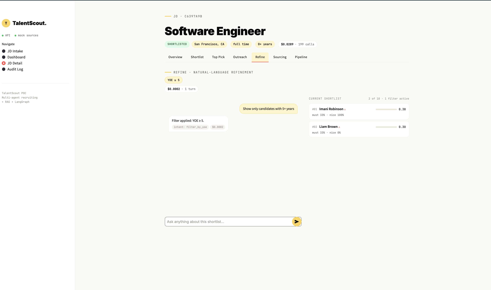

# TalentScout

A multi-agent recruitment funnel that takes a job description and produces, in
about 2 minutes and 5 cents of LLM cost, a ranked candidate shortlist with
auditable per-criterion reasoning and personalized outreach drafts. Built on
LangGraph for orchestration, OpenAI's `gpt-4o-mini` for LLM calls, hybrid RAG
retrieval (Chroma + BM25 + RRF + bge-reranker) for candidate search, and a
two-layer bias guardrail (regex + LLM classifier) for legally-sensitive
phrasing.

Stack: Python 3.11 / 3.12 / 3.13, LangGraph, FastAPI, Streamlit, SQLite,
ChromaDB, OpenAI SDK, sentence-transformers (for the cross-encoder reranker).

---

## What it does

1. Recruiter pastes a job description into the Streamlit UI.
2. **Guardrails agent** checks for discriminatory language (two layers: regex
   for obvious cases like "no family commitments", LLM for polished bias like
   "native English speaker"). If flagged, the pipeline halts in <2s.
3. **JD intake agent** parses the JD into structured fields — title, location,
   YOE band, must-have skills, nice-to-have skills.
4. **Sourcing agent** queries 3 mock candidate sources (LinkedIn, Naukri, ATS)
   in parallel, normalizes responses into a common schema, dedupes by
   `(normalized_name, location)` with a merge-audit trail.
5. **Profile summary agent** writes a bias-blind 2-3 sentence summary per
   candidate (name and location stripped — only experience and skills go to
   the LLM). Async fan-out, ~110 candidates in 20 seconds.
6. **Screening agent** scores each candidate against each JD criterion
   independently, with verbatim evidence quotes pulled from the candidate's
   profile. Async fan-out, bounded concurrency.
7. **Ranking agent** computes overall coverage scores and writes a per-candidate
   rationale that aggregates the per-criterion evidence.
8. **Top-pick agent** does a head-to-head LLM comparison on the top 3 shortlist
   candidates with names replaced by UUIDs (UUID-blind ranking — the LLM cannot
   discriminate on name).
9. **Outreach agent** drafts personalized emails for the top picks using
   OpenAI tool calling — the LLM calls `get_candidate_profile`,
   `get_jd_match_context`, then `draft_outreach_email` in sequence.
10. **Refinement agent** (post-pipeline) handles natural-language recruiter
    questions about the shortlist: "show only 5+ years," "compare #1 and #2,"
    "why is the first one a good fit?" — dispatches one of 11 tools via OpenAI
    tool calling.

All state persists to SQLite. Costs and events are tracked per agent.

---

## Verified results

Test suite of 10 JDs + 1 refinement flow, last run on the seed candidate pool:

```
Pipeline: 10 clean · 0 warnings · 0 failures
Refinement: 1 pass · 0 fail
Total cost: $0.41
Total runtime: 19 min

01 senior_ml_engineer            ✓ shortlisted · 128s · $0.0505 · top pick 0.45
02 backend_engineer_fintech      ✓ shortlisted · 168s · $0.0643 · top pick 0.77
03 staff_platform_engineer       ✓ shortlisted · 148s · $0.0428 · top pick 0.74
04 mobile_engineer_ios           ✓ shortlisted · 205s · $0.0699 · top pick 0.66
05 time_series_ml_engineer       ✓ shortlisted · 181s · $0.0768 · top pick 0.34
06 data_engineer_streaming       ✓ shortlisted · 140s · $0.0576 · top pick 0.91
07 vague_software_engineer       ✓ shortlisted ·  87s · $0.0289 · top pick 0.78
08 niche_rust_embedded           ✓ shortlisted ·  81s · $0.0166 · top pick 0.00
09 coded_age_bias                ✓ rejected_guardrail · 1.7s · $0.0001
10 polished_nationality_bias     ✓ rejected_guardrail · 1.9s · $0.0002
R1 refinement_flow               ✓ 4/4 turns · 11.3s · $0.0011
```

Test 08 (Rust embedded) is the calibration test — pool has near-zero matches,
so the top pick correctly scored 0.00. The system did not hallucinate strong
matches; it returned honest low scores.

Tests 09 and 10 are guardrail tests — both rejected in under 2 seconds for
less than a tenth of a cent each.

Run the suite yourself with `python -m scripts.run_test_suite` (writes a fresh
`test_results/run_<timestamp>/summary.md`).

---

## Setup and run

### Requirements

- Python 3.11, 3.12, or 3.13 (3.14 not yet supported — some dependencies
  don't have wheels for it)
- An OpenAI API key with billing enabled (the project uses `gpt-4o-mini`)
- About 50 MB of disk space for the bge-reranker model (downloaded on first run)
- macOS, Linux, or WSL on Windows

### One-command run

```bash
git clone https://github.com/neeraj-pola/talentscout
cd talentscout
./run.sh
```

The first time you run `./run.sh` it will:
1. Detect a compatible Python version (3.11–3.13)
2. Create a Python virtual environment in `.venv/`
3. Install dependencies from `requirements.txt` (takes 3-5 minutes the first time
   — downloads PyTorch, sentence-transformers, etc.)
4. Copy `.env.example` to `.env` and stop with a message asking you to add
   your OpenAI key
5. After you add the key, re-run `./run.sh`

On subsequent runs it will:
1. Activate the existing venv (instant)
2. Start the mock candidate-source HTTP server on port 9417
3. Start the FastAPI orchestrator on port 8000 (the first start after install
   takes 30-60s while torch/chromadb load into memory; subsequent starts are
   <5s)
4. Start the Streamlit UI on port 8501 (foreground, so you see its logs)

Press **Ctrl+C once** to kill all three processes cleanly.

### Try a demo JD

After the UI loads at `http://localhost:8501`, open [`demo/README.md`](demo/README.md)
— it lists 10 ready-to-paste JDs you can submit to the Intake form, each
demonstrating a specific behavior (happy path, calibration, guardrail
rejection, etc.).

Quick demo path:
- `demo/02_backend_engineer_fintech.md` — clean happy path, strong top pick
- `demo/08_niche_rust_embedded.md` — calibration test, top pick scores 0.00
- `demo/09_coded_age_bias.md` — guardrail rejection in <2s

After running `demo/05_time_series_ml_engineer.md`, try the **Refine** view
to chat naturally with the shortlist (filter by years, compare candidates,
ask why someone ranked highly).

---

## Cost expectations

Using `gpt-4o-mini` against the seed candidate pool of ~110 candidates:

| Operation                         | Typical cost     |
| --------------------------------- | ---------------- |
| Submit and process one JD         | $0.03 – $0.08    |
| One refinement chat turn          | $0.0002 – $0.001 |
| Reject a guardrail-violating JD   | $0.0001 – $0.0002|
| Full test suite (10 JDs + R1)     | ~$0.41           |

These numbers come from real runs. The biggest single cost is per-criterion
screening (one LLM call per `(candidate, criterion)` pair, typically 4
criteria × 110 candidates = 440 calls per JD).

---

## Project layout

```
talentscout/
├── run.sh                    # one-command launcher (this is what you run)
├── .env.example              # template — copy to .env and add OPENAI_API_KEY
├── requirements.txt
│
├── app/                      # backend (FastAPI + LangGraph)
│   ├── agents/               # 8 agents — one file per agent
│   │   ├── guardrails.py
│   │   ├── jd_intake.py
│   │   ├── sourcing.py
│   │   ├── profile_summary.py
│   │   ├── screening.py
│   │   ├── ranking.py
│   │   ├── top_pick.py
│   │   ├── outreach.py       # uses OpenAI tool calling
│   │   └── refinement.py     # uses OpenAI tool calling (11 tools)
│   ├── tools/                # tool layer — what the spec calls "tools"
│   │   ├── sources/          # search each candidate source
│   │   ├── profile_fetcher.py
│   │   ├── scorer.py
│   │   ├── outreach_writer.py
│   │   ├── state_updater.py
│   │   └── jd_closer.py
│   ├── orchestrator/         # LangGraph wiring
│   │   ├── graph.py
│   │   ├── nodes.py
│   │   └── state.py
│   ├── rag/                  # Chroma + BM25 + RRF + bge-reranker
│   ├── api/                  # FastAPI endpoints
│   ├── storage/              # SQLite repos
│   ├── normalize/            # per-source response normalizers
│   ├── obs/                  # cost tracking + events
│   └── models/               # Pydantic models
│
├── ui/                       # Streamlit frontend
│   ├── app.py                # entry point — Streamlit runs this
│   ├── api_client.py         # HTTP client for the FastAPI backend
│   ├── styles.py             # shared CSS
│   └── views/
│       ├── dashboard.py      # JD list landing page
│       ├── intake.py         # new-JD form
│       ├── pipeline.py       # live pipeline flowchart
│       ├── detail.py         # JD detail — shortlist, top pick, outreach drafts
│       ├── refine.py         # natural-language refinement chat
│       └── audits.py         # closure audit records
│
├── mock_sources_api/         # mock HTTP server for the 3 candidate sources
│   ├── server.py
│   └── seed/                 # 110 seed candidate profiles
│
├── scripts/                  # standalone scripts (test suite, mock data loaders)
│   └── run_test_suite.py
│
├── demo/                     # ready-to-paste JD demos for the reviewer
│   ├── README.md
│   ├── 01_senior_ml_engineer.md
│   ├── ... (10 demo JDs total)
│   └── 10_polished_nationality_bias.md
│
└── docs/                     # additional docs
    ├── architecture.md       # agent topology + data flow
    ├── decisions.md          # design choices + trade-offs
    ├── pipeline.png          # UI screenshots referenced from this README
    ├── shortlist.png
    ├── refine.png
    └── cost.png
```

---

## Architecture at a glance

```
                    ┌──────────────┐
                    │ Recruiter    │ pastes JD in Streamlit UI
                    └──────┬───────┘
                           ▼
                    ┌──────────────┐
                    │ FastAPI      │ POST /jds
                    └──────┬───────┘
                           ▼
        ┌──────────────────────────────────────────┐
        │  LangGraph orchestrator (8 nodes)        │
        │                                          │
        │  guardrails ── if discriminatory ──► END │
        │       │                                  │
        │       ▼                                  │
        │  jd_intake                               │
        │       ▼                                  │
        │  sourcing  ──► tool.linkedin/naukri/ats  │
        │       ▼                                  │
        │  profile_summary  (async fan-out)        │
        │       ▼                                  │
        │  screening        (async fan-out)        │
        │       ▼                                  │
        │  ranking          (per-candidate)        │
        │       ▼                                  │
        │  top_pick         (UUID-blind LLM)       │
        │       ▼                                  │
        │  outreach         (OpenAI tool calling)  │
        │       ▼                                  │
        │      END                                 │
        └──────────────┬───────────────────────────┘
                       ▼
                ┌──────────────┐
                │  SQLite      │ talentscout.db
                └──────────────┘

        ┌────────────────────────────────────────┐
        │  Post-pipeline:                        │
        │  refinement agent (11 tools)           │
        │  POST /jds/{id}/refine                 │
        │  filter/explain/compare/regenerate/... │
        └────────────────────────────────────────┘
```

A more detailed architecture description — including the tool layer, the data
flow, and the full state model — is in [`docs/architecture.md`](docs/architecture.md).
Design trade-offs and the reasoning behind specific choices (why hybrid
retrieval, why two-layer guardrails, why UUID-blind ranking, etc.) are in
[`docs/decisions.md`](docs/decisions.md).

---

## What the UI shows

The UI has six views, accessible from the sidebar.

**Dashboard** — list of all JDs you've submitted, with their status (in
progress, shortlisted, rejected, closed). Click any JD to open its detail.

**Intake** — form to submit a new JD. Fields: title, description, must-have
skills, nice-to-have skills, YOE band, location, employment type, target
hiring date.

**Pipeline** — live flowchart of the 8 pipeline nodes with per-node status,
duration, cost, and number of LLM calls. Live activity log on the right
shows agent events as they happen. The cost / observability panel sits
alongside the flowchart — total cost, LLM call count, per-agent breakdown.





**Detail** — for a completed JD: top 10 ranked candidates with overall
scores, per-criterion coverage percentages, the bias-blind profile summary,
the LLM's overall rationale, red-flag indicators (⚠) when must-have gaps
exist. The Detail view also shows the top pick recommendation and the
generated outreach drafts (LinkedIn InMail + email subject + body) for the
top candidates.



**Refine** — natural-language chat against the shortlist. Active filters
shown as pills at the top. Live filtered preview on the right. Each
recruiter turn dispatches via OpenAI tool calling (11 tools registered,
one per intent).



**Audits** — record of every JD that's been formally closed with a chosen
candidate, including the justification, the ranking snapshot, total cost,
and who closed it.

---

## Common questions

**Why is it slow?**
Each JD makes 300-500 LLM calls (one per `(candidate, criterion)` pair plus
ranking, top-pick, outreach). gpt-4o-mini latency is ~400ms per call. So a
full pipeline takes 90-200 seconds. This is the trade-off for evidence-backed
scoring — every score traces back to a verbatim quote from the candidate's
profile. A "one LLM call per candidate" approach would finish in 30 seconds
but produce scores you can't audit. See [`docs/decisions.md`](docs/decisions.md)
for the full reasoning.

**Why mock candidate sources instead of real LinkedIn / Naukri?**
LinkedIn Talent Solutions and Naukri Resdex are partner-only APIs requiring
enterprise contracts. The mock servers speak the same shape a real adapter
would (search by query + location + YOE band, paginate, fetch detail by ID).
Swapping to real sources is per-source adapter work, not architectural —
about 2 weeks of engineering once API access is granted. See
[`docs/decisions.md`](docs/decisions.md) for the integration roadmap.

**Where does state live?**
Everything in SQLite (`talentscout.db`). JD records, parsed JDs, deduped
profiles, shortlists, top picks, outreach drafts, refinement conversation
history, cost rows, audit records on closure. The Chroma vector index lives
in `chroma_db/` (rebuilt per JD; cleaned up after). Event logs append to
`events.jsonl`. LangGraph checkpoints in `graph_state.db`.

**How do I wipe state for a clean demo?**
```bash
rm -f talentscout.db graph_state.db events.jsonl
rm -rf chroma_db/ test_results/
find . -type d -name __pycache__ -exec rm -rf {} +
```
Then restart `./run.sh`. The UI will show "no JDs yet."