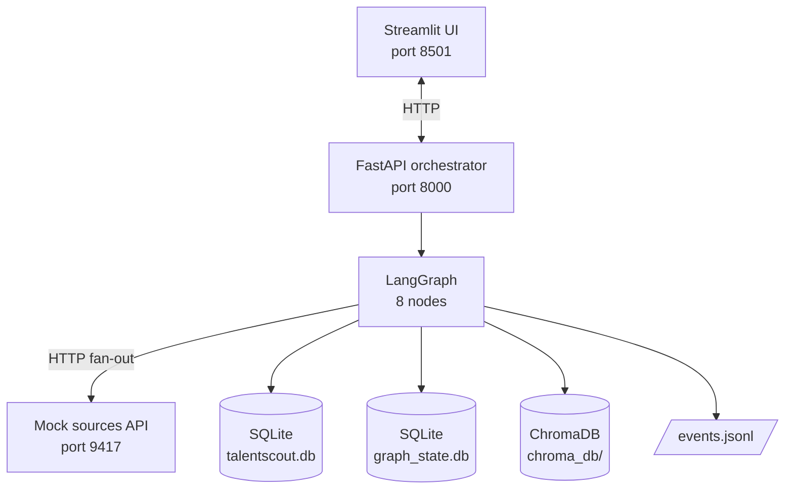
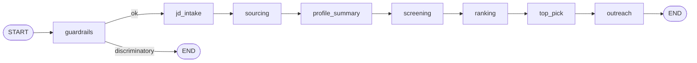
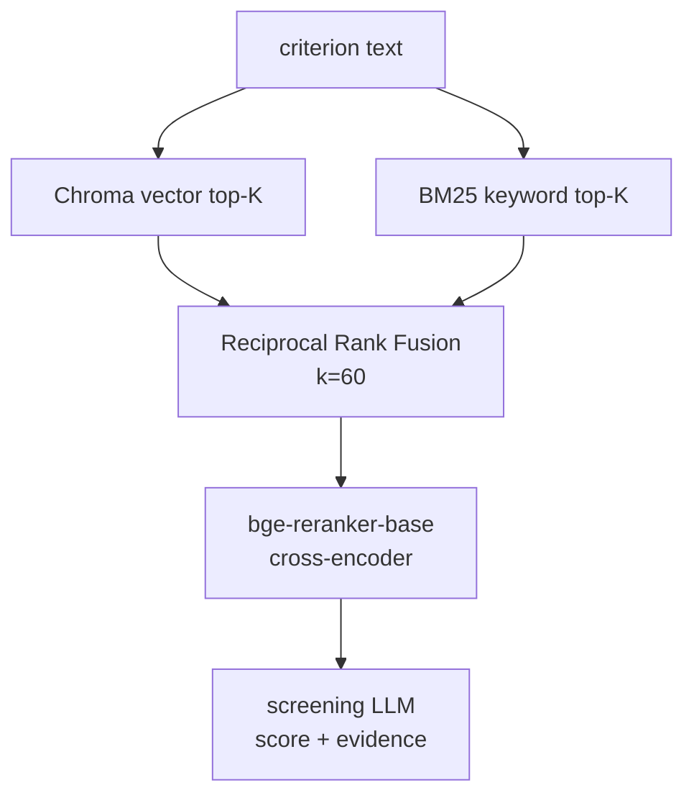

# Architecture

This document describes how TalentScout is built — agent topology, data
flow, state, and the RAG and guardrail subsystems. For *why* specific
choices were made (e.g. why hybrid retrieval, why LangGraph, why
`gpt-4o-mini`), see [`decisions.md`](decisions.md).

Target reader: a technical reviewer who has already cloned the repo and
seen the pipeline run once. Estimated read time: 10-12 minutes.

---

## Table of contents

1. [System at a glance](#1-system-at-a-glance)
2. [The 8 pipeline agents](#2-the-8-pipeline-agents)
3. [The refinement sub-loop](#3-the-refinement-sub-loop)
4. [The tool layer — two meanings](#4-the-tool-layer--two-meanings)
5. [State and storage](#5-state-and-storage)
6. [RAG pipeline](#6-rag-pipeline)
7. [Guardrails](#7-guardrails)
8. [Mapping to the spec](#8-mapping-to-the-spec)

---

## 1. System at a glance

Three running services. One HTTP backend, one UI, one mock data source.

```
┌─────────────────────────────────────────────────────────────────────┐
│                Recruiter's browser (Streamlit UI)                   │
│             port 8501 · views: intake / pipeline /                  │
│                shortlist / refine / outreach / cost                 │
└────────────────────────────┬────────────────────────────────────────┘
                             │ HTTP
                             ▼
┌─────────────────────────────────────────────────────────────────────┐
│                FastAPI orchestrator  (port 8000)                    │
│                                                                     │
│  POST /jds              → submit JD, run full pipeline              │
│  GET  /jds              → list all JDs                              │
│  GET  /jds/{id}         → JD detail (parsed, shortlist, drafts...)  │
│  POST /jds/{id}/refine  → one natural-language refinement turn      │
│  POST /jds/{id}/close   → close JD + write audit record             │
│                                                                     │
│  ┌───────────────────────────────────────────────────────────────┐  │
│  │ LangGraph orchestrator                                        │  │
│  │   8 nodes wired sequentially, with one early-exit edge        │  │
│  │   from guardrails when JD is discriminatory                   │  │
│  └───────────────────────────────────────────────────────────────┘  │
└─────┬─────────────────────────────────────────────────────────┬─────┘
      │ HTTP (during sourcing)                                  │
      ▼                                                         ▼
┌─────────────────────┐                              ┌─────────────────┐
│  Mock sources API   │                              │   Persistence   │
│   (port 9417)       │                              │                 │
│  /linkedin/search   │                              │  talentscout.db │
│  /naukri/search     │                              │  graph_state.db │
│  /ats/search        │                              │  chroma_db/     │
│  /.../{id}          │                              │  events.jsonl   │
│                     │                              │                 │
│  Backed by ~110     │                              │  See §5         │
│  synthetic profile  │                              │                 │
│  JSONs in seed/     │                              │                 │
└─────────────────────┘                              └─────────────────┘
```

### Mermaid version (renders on GitHub)



The Streamlit UI is the only thing the recruiter touches. Everything else
runs in the background. State persists to four different stores (described
in §5) — each chosen for a specific access pattern.

---

## 2. The 8 pipeline agents

The orchestrator wires 8 nodes. The first node has one conditional edge:
if guardrails flags the JD as discriminatory, the pipeline jumps to END.
Otherwise it runs straight through.

```
START → guardrails ─[ok]──► jd_intake ──► sourcing ──► profile_summary
                                                          │
                                                          ▼
        ┌──────────── outreach ◄── top_pick ◄── ranking ◄── screening
        │
        ▼
       END

        guardrails ─[discriminatory]──► END
```

### Mermaid version



The 8 agents at a glance:

### guardrails

| | |
|---|---|
| **Purpose** | Detect discriminatory criteria in the JD before any candidate work begins. |
| **Input** | Raw JD (title + description + must-haves + nice-to-haves). |
| **Output** | `GuardrailVerdict` with `is_discriminatory: bool`, `reasons: list[str]`, `flagged_phrases: list[str]`. |
| **LLM model** | `gpt-4o-mini` for layer 2 only (layer 1 is regex). |
| **Calls per JD** | 0 (regex catches it) or 1 (LLM layer fires). |
| **Typical cost** | $0.0001 – $0.0002. |
| **Typical latency** | < 2s. |
| **Concurrency** | N/A (single call). |
| **Details** | See §7 — Guardrails. |

### jd_intake

| | |
|---|---|
| **Purpose** | Parse the JD into a structured `ParsedJD` (criteria list, location, YOE band, seniority signal). |
| **Input** | Raw JD. |
| **Output** | `ParsedJD` with `criteria: list[Criterion]` (each labeled must-have or nice-to-have). |
| **LLM model** | `gpt-4o-mini` with JSON-mode response format. |
| **Calls per JD** | 1. |
| **Typical cost** | $0.0003. |
| **Typical latency** | 2-4s. |
| **Concurrency** | N/A. |

### sourcing

| | |
|---|---|
| **Purpose** | Query 3 candidate sources in parallel, normalize responses, dedupe. |
| **Input** | `ParsedJD`. |
| **Output** | `SourcingResult` (deduped `list[CommonProfile]` + merge audit). |
| **LLM calls** | 0 — sourcing is pure HTTP + Python. |
| **HTTP calls** | ~12 (3 sources × ~4 pages each via `search_one_source_paginated`). |
| **Typical latency** | 5-8s (parallel fan-out across sources). |
| **Concurrency** | 3-way parallel across sources via `asyncio.gather`. Per-source pagination is sequential within a source. |
| **Tools used** | `app/tools/sources/{linkedin,naukri,ats}.py` for search; `app/normalize/` for schema conversion; `app/dedup/` for merge logic. |

### profile_summary

| | |
|---|---|
| **Purpose** | Generate a bias-blind 2-3 sentence summary per candidate. Acts as both a token compressor for downstream agents AND a bias firewall — name, location, and other protected attributes are stripped before the LLM sees the profile. |
| **Input** | `list[CommonProfile]`. |
| **Output** | Same list with `summary: str` populated on each profile. |
| **LLM model** | `gpt-4o-mini` (cheap model — task is short and pattern-uniform). |
| **Calls per JD** | One per deduped candidate (typically 100-120). |
| **Typical cost** | $0.01 – $0.02. |
| **Typical latency** | ~20s. |
| **Concurrency** | Async fan-out via `asyncio.Semaphore(8)`. |

### screening

| | |
|---|---|
| **Purpose** | Score each candidate against each JD criterion independently, with verbatim evidence quotes from the candidate's profile. |
| **Input** | `ParsedJD` + RAG index over profile pool. |
| **Output** | `list[ScoredCandidate]` (each with per-criterion scores, evidence quotes, has_must_have_gap flag). |
| **LLM model** | `gpt-4o-mini` with JSON-mode. |
| **Calls per JD** | Roughly `n_candidates × n_criteria` — typically 300-500. |
| **Typical cost** | $0.03 – $0.06 (the biggest single line item). |
| **Typical latency** | 60-90s. |
| **Concurrency** | Async fan-out with `asyncio.Semaphore(8)` over (candidate, criterion) pairs. |
| **Retrieval** | Uses hybrid RAG (§6) to find candidate evidence per criterion before scoring. |

### ranking

| | |
|---|---|
| **Purpose** | Compute overall coverage scores from per-criterion scores, write a per-candidate rationale aggregating the evidence. |
| **Input** | `list[ScoredCandidate]` (post-screening). |
| **Output** | Same list, sorted by `overall_score`, top 10 returned as shortlist; each with `rationale: str`. |
| **LLM model** | `gpt-4o-mini`. |
| **Calls per JD** | One per shortlisted candidate (10). |
| **Typical cost** | $0.005 – $0.01. |
| **Typical latency** | 25s (currently sequential; see `decisions.md` for the parallelization note). |
| **Concurrency** | Sequential — kept this way deliberately to avoid LLM context confusion across candidates. |

### top_pick

| | |
|---|---|
| **Purpose** | Pick ONE candidate to recommend with justification. Crucially: candidates are passed to the LLM with **UUIDs instead of names** so the model cannot discriminate on name (a known bias vector in LLMs). |
| **Input** | Top 3 shortlist entries. |
| **Output** | `TopPickRecommendation` with recommended UUID + justification. Name substitution happens at render time, not LLM time. |
| **LLM model** | `gpt-4o-mini`. |
| **Calls per JD** | 1 (single head-to-head call). |
| **Typical cost** | $0.0005 – $0.001. |
| **Typical latency** | 5s. |

### outreach

| | |
|---|---|
| **Purpose** | Draft personalized outreach (LinkedIn InMail + email subject + email body) for the top 3 picks. **This is one of the two agents that uses LLM tool calling** (see §4). |
| **Input** | Top 3 shortlisted candidates + their profile excerpts + the parsed JD. |
| **Output** | `list[OutreachDraft]` (3 drafts). |
| **LLM model** | `gpt-4o-mini` with `tools=[...]`. Three tools available: `get_candidate_profile`, `get_jd_match_context`, `draft_outreach_email`. The LLM orchestrates the call sequence per draft. |
| **Calls per JD** | 3 drafts × ~3 tool round-trips each = ~9 LLM calls. |
| **Typical cost** | $0.005 – $0.01. |
| **Typical latency** | ~30s (3 drafts, 10s each). |

The outreach agent demonstrates real LLM tool calling. The schema looks like:

```python
OUTREACH_TOOLS = [
    {
        "type": "function",
        "function": {
            "name": "get_candidate_profile",
            "description": "Get the candidate's bias-blind summary and key experience signals.",
            "parameters": {"type": "object", "properties": {
                "candidate_id": {"type": "string"}
            }, "required": ["candidate_id"]}
        }
    },
    # ... plus get_jd_match_context and draft_outreach_email
    # with similar shapes (see app/agents/outreach.py).
]
```

The LLM is given the tools and an instruction like *"Draft outreach for
candidate X."* It calls `get_candidate_profile` first, sees the summary,
calls `get_jd_match_context` to see what's strong vs weak, then calls
`draft_outreach_email` with a personalization hook drawn from the
summary. The dispatcher in `app/agents/outreach.py` executes each tool
call and feeds the result back. A deterministic single-shot fallback
exists if the LLM doesn't emit tool calls.

---

## 3. The refinement sub-loop

Refinement is **not** a pipeline node. It runs after the pipeline
finishes, in response to recruiter messages on the Refine tab.

```
                   ┌───────────────────────────────┐
 Recruiter sends → │   POST /jds/{id}/refine       │
 "show only 5+     │                               │
  years"           │   refinement agent:           │
                   │     1. load context           │
                   │     2. classify intent via    │
                   │        OpenAI tool calling    │
                   │     3. dispatch to handler    │
                   │     4. update filter_stack    │
                   │     5. persist conversation   │
                   │                               │
                   └───────────┬───────────────────┘
                               ▼
                       refined_shortlist + assistant reply
```

The refinement agent demonstrates the second LLM-tool-calling boundary
in the system. It defines 11 tools, one per recruiter intent:

| Intent / Tool | What it does | LLM calls |
|---|---|---|
| `filter_by_location` | Add a location filter to the stack | 0 |
| `filter_by_yoe` | Add a YOE band filter | 0 |
| `filter_by_skill` | Resolve a skill phrase to canonical skill, add filter | 1 (resolver) |
| `exclude_flagged` | Drop red-flagged candidates | 0 |
| `clear_filters` | Reset the filter stack | 0 |
| `explain_candidate` | Why does candidate X rank where they do? | 1 |
| `compare_candidates` | Head-to-head between A and B | 1 |
| `regenerate_outreach` | Re-draft outreach with a tone modifier | 1 |
| `find_similar` | Re-screen for more candidates like X (full re-screen) | many |
| `get_candidate_details` | Surface raw profile fields (skills, experience, etc.) | 1 |
| `clarify` | Fallback when input is ambiguous | 0 |

The classifier uses `tool_choice="required"` so the LLM is forced to pick
exactly one tool. A JSON-mode fallback exists if the tool-calling API
errors or returns an unknown tool — same belt-and-suspenders pattern as
outreach.

Two more details worth noting about refinement:

- **Filter stack semantics**: filters of the same type *replace* each
  other (sending "5+ years" twice gives ONE filter, not two). Skill
  filters are an exception — they intentionally stack (multi-skill
  filtering is a real use case).
- **Pronoun resolution**: a small "RECENT CONTEXT" block is included in
  the classifier user message identifying the last-discussed candidate.
  The LLM uses this to resolve "she/her/he/him/this candidate" to a
  concrete name. A belt-and-suspenders Python check fires
  `pronoun_recovery` if the LLM still routes to `clarify` despite a
  resolvable pronoun being present.

---

## 4. The tool layer — two meanings

"Tool calling" appears twice in this system in two distinct senses. The
distinction matters for understanding the architecture.

### Sense 1: `app/tools/` — orchestrator-callable functions

These are Python functions the orchestrator (and refinement agent) call
directly. The spec calls these out: *"The agent must use tools for:
searching each source, fetching profile details, scoring candidates,
drafting outreach, updating JD state, and closing the JD."*

| Tool | What it wraps | Called by |
|---|---|---|
| `app/tools/sources/{linkedin,naukri,ats}.py` | HTTP search + pagination + retries | sourcing agent |
| `app/tools/profile_fetcher.py` | Single-profile fetch with retry | (available for future agents) |
| `app/tools/scorer.py` | Wraps screening agent's run | refinement's `find_similar` |
| `app/tools/outreach_writer.py` | Wraps outreach agent for a given candidate set | orchestrator's outreach node |
| `app/tools/state_updater.py` | All JD-state mutations (parsed, sourcing, profiles, shortlist, top_pick, outreach, status, refinement state, guardrail verdict) | every pipeline node + refinement |
| `app/tools/jd_closer.py` | Atomic close + audit record | server.py's close endpoint |

Every tool logs a structured event (`tool.<name> <event>`) so a reviewer
can `grep "tool\." events.jsonl` and see the entire tool surface being
exercised on a real run.

### Sense 2: LLM-dispatched tool calling via OpenAI

This is the spec-aligned demonstration of agents picking tools at
runtime. Used in two agents:

- **outreach** — 3 tools, LLM orchestrates a per-draft sequence
- **refinement** — 11 tools, LLM classifies recruiter intent by picking the right one

The OpenAI SDK call shape:

```python
resp = client.chat.completions.create(
    model="gpt-4o-mini",
    messages=[...],
    tools=REFINEMENT_TOOLS,
    tool_choice="required",  # forces a tool call
)
# resp.choices[0].message.tool_calls[0].function.name → which tool
# resp.choices[0].message.tool_calls[0].function.arguments → JSON args
```

These two senses are independent. Sense 1 is about *code organization*
— "all DB writes go through one place, all source HTTP goes through
one place." Sense 2 is about *runtime dispatch* — "let the LLM decide
which function to invoke."

---

## 5. State and storage

Four persistent stores, each chosen for a specific access pattern.

```
talentscout.db (SQLite via SQLAlchemy)
├─ jds                     full JD lifecycle (parsed, sourcing, profiles,
│                          shortlist, top_pick, outreach, status, refinement,
│                          guardrail verdict, all as JSON columns)
├─ audits                  closure audit records
└─ llm_costs               every LLM call with model, tokens, $ cost, agent

graph_state.db (SQLite via langgraph-checkpoint-sqlite)
└─ langgraph checkpoints   per-node state for resumption (not actively used
                           for resumption in this build, but the checkpointer
                           is wired and operational)

chroma_db/ (ChromaDB on-disk)
└─ per-JD collections      vector index built fresh per JD over its deduped
                           candidate pool. Cleaned up when JD closes (or stays
                           until manual cleanup; not load-bearing either way).

events.jsonl
└─ append-only event log   every agent_start/agent_end, every LLM call,
                           every tool dispatch, every node transition.
                           Read by the Pipeline tab and the test suite report.
```

### What lives where, in plain language

- A JD row carries the entire pipeline output **as JSON columns** on
  one row in the `jds` table: `parsed_jd_json`, `profiles_json`,
  `shortlist_json`, `top_pick_json`, `outreach_json`,
  `sourcing_json`, `guardrail_verdict_json`, `refinement_state_json`.
  Trade-off: not normalized, but JD records are write-mostly and
  read-as-a-whole (the UI fetches the entire JD detail in one query),
  so a JSON-per-stage schema is cheaper than 10 joined tables.
- LangGraph's own checkpoints live in `graph_state.db` because
  `langgraph-checkpoint-sqlite` wants its own SQLite file. We don't
  use checkpoint resumption in the current build, but the wiring is
  there if a future change wants to support pipeline restart.
- Chroma is **per-JD** — one collection per JD ID, populated during
  sourcing with the deduped candidate pool. The screening agent
  queries this collection. After close, collections aren't auto-
  cleaned (they're cheap), but a manual `rm -rf chroma_db/` between
  demos works.
- `events.jsonl` is append-only structured logging. Both the UI's
  Pipeline tab and the test suite's report consume this. One line per
  event; agent name, event name, JD ID, timestamp, plus arbitrary
  payload kwargs.

### Cost tracking

Every LLM call goes through `app/obs/cost.py::record_cost(agent, model,
usd, tokens_in, tokens_out)`. The function inserts a row into
`llm_costs` and emits an event to `events.jsonl`. Per-agent rollups are
computed on the fly when the UI requests the cost summary. No
double-bookkeeping.

---

## 6. RAG pipeline

The screening agent retrieves candidate evidence per criterion. Pure vector
search misses exact-skill keyword matches; pure BM25 misses paraphrased
concepts. So the system uses **hybrid retrieval with reciprocal rank fusion
plus a cross-encoder reranker**.

```
   criterion text
        │
   ┌────┴────┐
   ▼         ▼
 Chroma    BM25
 vector    keyword
 top-K     top-K
   │         │
   └────┬────┘
        ▼
       RRF      score = Σ 1/(k + rank_i),  k=60
        │
        ▼
  bge-reranker     cross-encoder, much more accurate
  (top-K reranked) than the bi-encoder retrieval above
        │
        ▼
  screening LLM
  (score + evidence)
```

### Mermaid version



The RRF fusion code (from `app/rag/`):

```python
def reciprocal_rank_fusion(rankings: list[list[str]], k: int = 60) -> dict[str, float]:
    """Combine multiple ranked lists. Items high in multiple lists score
    highest; items in only one list still appear but rank lower."""
    scores: dict[str, float] = {}
    for ranking in rankings:
        for rank, item_id in enumerate(ranking):
            scores[item_id] = scores.get(item_id, 0.0) + 1.0 / (k + rank + 1)
    return scores
```

The reranker is `BAAI/bge-reranker-base` via `sentence-transformers`. It's a
cross-encoder — it takes `(query, candidate)` pairs and produces relevance
directly. Much more accurate than the bi-encoder embeddings used in
first-stage retrieval, but too expensive to run over the full corpus. Hence
the two-stage shape: retrieve cheaply (top-K vector + top-K BM25 → fuse →
top-K), then rerank precisely.

This setup is what lets test 05 (Time Series ML) surface candidates whose
profiles mention "Prophet" and "forecasting" but never use the exact phrase
"time series" — the embedding catches the semantic similarity, the reranker
confirms it.

---

## 7. Guardrails

Two layers. Both run inside the `guardrails` agent — the first node of
the pipeline.

### Layer 1 — regex patterns

A list of compiled regex patterns matched against the JD's title +
description + skill lists. Catches the legally most-exposed phrasings:

- Age proxies: `young`, `energetic`, `digital native`, `recent grad`
- Family-status proxies: `no family commitments`, `singles preferred`
- Coded fitness language: `able-bodied`, `must be physically fit`
- Direct slurs / explicit protected-class mentions

Each pattern carries a reason string. A hit returns
`is_discriminatory=True` *without* an LLM call. Cheap (~$0), fast
(<10ms), audit-friendly.

### Layer 2 — LLM classifier

If regex finds nothing, an LLM is asked to read the JD and identify
*intent*-level discrimination — phrasings that aren't slur patterns but
collectively encode discrimination. Examples that layer 2 catches and
layer 1 doesn't:

- "Native English speakers preferred" (national-origin proxy)
- "Should have grown up in the United States" (national-origin proxy)
- "Ivy League graduates preferred" (class proxy)
- "From a top-tier university" (class proxy)

The LLM responds in JSON with `is_discriminatory`, `reasons`, and
`flagged_phrases`. Cost: ~$0.0001-$0.0002. Latency: ~1-2s.

### Why two layers

- Layer 1 catches the cheap cases for $0 in <100ms. If we only had the
  LLM layer, every JD would pay the LLM cost — wasteful for obvious
  rejections.
- Layer 2 catches the legally-savvy phrasings that pattern-matching
  misses. If we only had the regex layer, polished bias slips through.
- Two layers also gives different *kinds* of evidence in the audit
  record. Regex matches are quotable in court; LLM flags carry the
  classifier's reasoning. Both useful.

### What the orchestrator does on a flag

```python
if verdict.is_discriminatory:
    save_guardrail_verdict_tool(state["jd_id"], verdict)
    update_status(state["jd_id"], JDStatus.REJECTED_GUARDRAIL)
    return  # short-circuit; LangGraph routes to END

# else continue to jd_intake
```

No candidate work happens for rejected JDs. No LLM calls beyond the
guardrail classifier itself. The Rejected JD's verdict is persisted so
the UI can show *which* phrases flagged it.

---

## 8. Mapping to the spec

For verification — each spec requirement and where it lives.

### Functional

| Spec requirement | Where in the code |
|---|---|
| 1. JD intake form | `ui/views/intake.py` + `POST /jds` |
| 2. JD parsing into structured form | `app/agents/jd_intake.py` → `ParsedJD` |
| 3. Multi-source sourcing (3 parallel sources) | `app/agents/sourcing.py` + `app/tools/sources/{linkedin,naukri,ats}.py` |
| 4. Profile normalization (common schema) | `app/normalize/` → `CommonProfile` |
| 5. Deduplication across sources | `app/dedup/` (jellyfish + rapidfuzz on normalized name + location) |
| 6. Per-criterion screening with reasoning | `app/agents/screening.py` (one LLM call per (candidate, criterion) with verbatim evidence) |
| 7. Ranking + top-N shortlist with rationale | `app/agents/ranking.py` |
| 8. Top pick + justification | `app/agents/top_pick.py` (UUID-blind to prevent name bias) |
| 9. JD closure with audit record | `POST /jds/{id}/close` + `app/tools/jd_closer.py` |

### Technical

| Spec requirement | Where in the code |
|---|---|
| 1. RAG with hybrid retrieval + reranker | `app/rag/` — Chroma vector + BM25 + RRF + bge-reranker-base (§6) |
| 2. LLM usage: parsing, summary, screening, outreach, refinement | All 5 present — see agent table in §2 |
| 3. Tool calling for 6 operations | `app/tools/` covers all 6 (§4). Pagination via `search_one_source_paginated`; empty results handled in each tool; transient failures via tenacity retries (3 attempts, exponential backoff). |
| 4. Multi-agent + orchestrator + parallelism | LangGraph orchestrator with 8 agents (§2). Sourcing is 3-way parallel; screening + profile_summary use async fan-out with bounded concurrency. |
| 5. State persistence across turns | SQLite `jds.refinement_state_json` carries conversation history + filter stack; reloaded per refinement turn (§5) |
| 6. Guardrails + protected-attribute-free ranking | Two-layer guardrails (§7) + UUID-blind top_pick + bias-blind profile_summary that strips name/location before passing to downstream LLMs |
| 7. Observability + cost tracking per JD | `events.jsonl` for events + `llm_costs` table for token/cost per agent. UI surfaces both (§5) |

### Outputs

| Spec requirement | File / location |
|---|---|
| Runnable application (single command) | `./run.sh` |
| UI for JD lifecycle, shortlist, rationale, outreach | `ui/` — Streamlit views |
| `decisions.md` | `docs/decisions.md` |
| `architecture.md` with diagram | this file, `docs/architecture.md` |

---

That's the system. For trade-off reasoning behind specific choices, see
[`decisions.md`](decisions.md).
